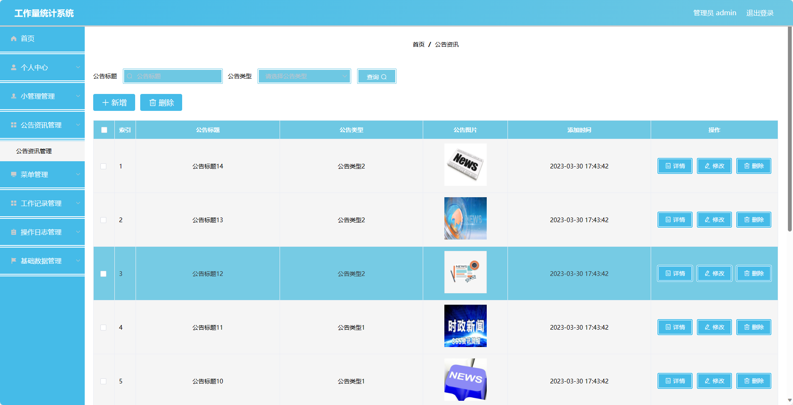

基于Springboot的工作量统计系统（程序+论文）
=
### 完整代码获取地址：从戎源码网 ([https://armycodes.com/](https://armycodes.com/))
### 作者微信：19941326836  QQ：952045282 
### 承接计算机毕业设计、Java毕业设计、Python毕业设计、深度学习、机器学习
### 选题+开题报告+任务书+程序定制+安装调试+论文+答辩ppt 一条龙服务
### 所有选题地址https://github.com/nature924/allProject

一、项目介绍
---
基于Spring Boot框架实现的工作量统计系统，系统包含两种角色：管理员、用户,主要功能如下。
### 前台模块：
- 个人中心：用户可以管理个人信息，包括修改密码等操作。
- 工作记录管理：用户可以添加、编辑和查看自己的工作记录，记录工作内容、时间等信息。

### 后台模块（管理员）：
- 个人中心：管理管理员的个人信息，包括修改密码等操作。
- 小管理管理：管理员可以管理小管理账号，包括添加、编辑和删除小管理账号等操作。
- 公告资讯管理：管理员可以发布和管理公告资讯，包括添加公告、编辑公告、删除公告等操作。
- 菜单管理：管理员可以管理系统菜单，包括添加、编辑和删除菜单等操作。
- 工作记录管理：管理员可以查看和统计用户的工作记录，包括按时间、按用户等条件进行筛选和统计。
- 操作日志管理：管理员可以查看系统的操作日志，包括用户登录、操作记录等信息。
- 基础数据管理：管理员可以管理系统的基础数据，如部门信息、员工信息等。

二、项目技术
---
- 编程语言：Java
- 数据库：MySQL
- 项目管理工具：Maven
- 前端技术：VUE、HTML、Jquery、Bootstrap
- 后端技术：Spring、SpringMVC、MyBatis

三、运行环境
---
- 操作系统：Windows、macOS都可以
- JDK版本：JDK1.8以上都可以
- 开发工具：IDEA、Ecplise、Myecplise都可以
- 数据库: MySQL5.7以上都可以
- Tomcat：任意版本都可以
- Maven：任意版本都可以

四、运行截图
---
### 论文截图：

### 程序截图：

